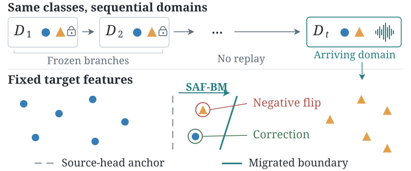
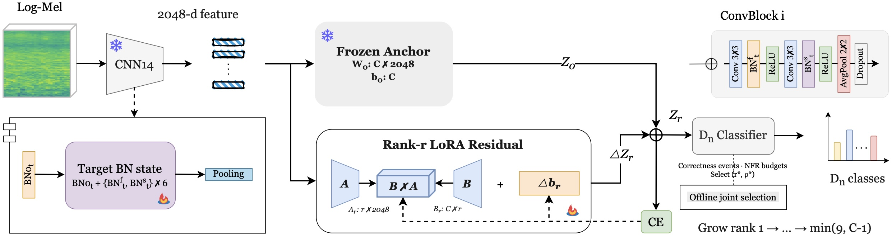

# SAF-BM: Source-Anchored Feasible Boundary Migration

[Method](docs/method.md) · [Data preparation](docs/data.md) · [Experiment guide](docs/experiments.md) · [MIT license](LICENSE)

## Why decision boundary migration?

An acoustic shift can leave examples in the wrong class regions even after target normalization. Moving the classifier's boundaries can correct these errors, but can also overturn correct predictions. SAF-BM studies this trade-off in fixed target-normalized coordinates. The retained source classifier anchors every arriving domain; historical examples are not replayed.



The contribution studied here is **how to control decision boundary migration**. Low-rank residuals provide a family of possible movements. Correctness events support joint selection of the movement's rank and deployed fraction under observed negative-flip budgets.

## System overview



1. Train or load the source CNN14 and its linear classifier.
2. Fit the arriving domain's BN on current-domain data, then freeze BN and the encoder.
3. Cache fit/validation features and train a sequence of rank-growing residual candidates around the source head.
4. Freeze each raw endpoint. Jointly select rank and interpolation fraction using fit/validation correctness events and class-balanced negative flip rate (NFR) budgets.
5. Merge the selected residual into a linear head. Retain each domain's frozen BN/head branch and evaluate historical retention using minimum-entropy routing over **seen branches only**.

`rank` limits shared directions for changes in pairwise boundary normals. `rho` is the deployed fraction of a candidate update; it is not training time or a common geometric distance across ranks. See [method details and numerical limits](docs/method.md).

## Installation and quick check

Python 3.10 or newer is required. From the repository root:

```bash
python -m venv .venv
source .venv/bin/activate
python -m pip install -r requirements.txt
python -m pip install --no-deps -e .
python -m unittest discover -s tests -v
python -m examples.smoke
```

The smoke example runs training, joint selection, merged-head inference, and held-out evaluation on temporary synthetic features. It needs no downloaded audio or checkpoint and deletes its temporary outputs. Its numbers are software checks, not paper results. For an optional heavier check of waveform loading, domain BN, CNN14, control export and three-domain entropy routing, run `python -m examples.audio_smoke`; it creates temporary random weights/audio and removes them on exit.

The release was checked locally with Python 3.13, PyTorch 2.11.0, NumPy 2.4.4, pandas 3.0.2, SciPy 1.17.1, librosa 0.11.0, soundfile 0.13.1 and torchlibrosa 0.1.0. Dependency lower bounds describe installation constraints, not a tested compatibility matrix. Select the appropriate PyTorch build for your accelerator; cached head training runs on CPU.

## Datasets

Download the data separately and create local manifests using [the data guide](docs/data.md). This repository distributes no audio, dataset manifests, feature caches, or trained weights.

| Stream used here | Classes | Domains | Configuration |
|---|---:|---:|---|
| DCASE-DIL | 10 | 3 | `configs/dcase.json` |
| TAU 2022 Mobile, devices A → B → C | 10 | 3 | `configs/tau.json` |
| ADIL, fixed four-class Europe/Korea stream | 4 | 5 | `configs/adil.json` |

- **DIL-DCASE26-Dev:** M. Mulimani, M. Harju, R. Casciotti, A. Mesaros (2026), [Zenodo dataset](https://doi.org/10.5281/zenodo.19335184).
- **TAU Urban Acoustic Scenes 2022 Mobile, Development dataset:** T. Heittola, A. Mesaros, T. Virtanen (2022), [Zenodo dataset](https://doi.org/10.5281/zenodo.6337421).
- **ADIL:** follow [Mulimani and Mesaros (ICASSP 2025)](https://doi.org/10.1109/ICASSP49660.2025.10890481). The included fixed four-class builder combines [TUT 2018](https://doi.org/10.5281/zenodo.1228142), [TAU 2019](https://doi.org/10.5281/zenodo.2589280), and [CochlScene](https://doi.org/10.5281/zenodo.7080122); this is a stream construction, not a fourth downloadable dataset.

## Train and select

The full audio-to-features workflow is in [docs/experiments.md](docs/experiments.md). Once a fit/validation cache exists:

```bash
python -m safbm.train \
  --config configs/dcase.json \
  --cache outputs/dcase/stage1/fit_validation.npz \
  --output-dir outputs/dcase/stage1/train

python -m safbm.select \
  --config configs/dcase.json \
  --cache outputs/dcase/stage1/fit_validation.npz \
  --proposal outputs/dcase/stage1/train/proposal.pth \
  --output-dir outputs/dcase/stage1/selected
```

Use the corresponding TAU/ADIL config and repeat for each arriving domain. All paths in example commands are relative to the repository root.

Selection produces:

| File | Meaning |
|---|---|
| `head.npz` | Frozen source head plus the **already scaled** deployed residual |
| `selection.json` | Selected rank/fraction, observed fit/validation metrics, config and SHA-256 hashes |
| `path_cells.json` | Enumerated constant-correctness intervals across the frozen rank family |

Training's `selected_state_dict` is a legacy provisional restored state. **Use the head exported by `safbm.select` for final deployment.** The selector reads `candidate_raw_states`; scaling restored endpoints again changes the intended paths.

## Evaluate

For sequential audio evaluation, edit the source/BN/head paths in a copy of `configs/registry.example.json`. Add two more branches for ADIL. The registry includes the source branch at index 0. Freeze all choices before running:

```bash
python -m safbm.evaluate_sequence \
  --registry configs/registry.example.json \
  --manifest manifests/dcase_seed1193.tsv \
  --data-root data/DIL-DCASE26 \
  --output-dir outputs/dcase/evaluation \
  --device auto
```

This extracts every frozen branch's logits on the same held-out examples and reports both known-domain accuracy and sequential metrics. Anchor and SAF-BM route using their own logits at temperature 1. Outputs include `metrics.json` and aligned `branch_logits.npz`.

- **Known-domain accuracy:** choose the BN/head pair using domain identity. This measures migration within a branch.
- **Accuracy matrix:** entry `A[t,j]` is macro accuracy on domain `j` after arrival `t`, routing only among branches `0..t`.
- **Final avg.:** equal average over available domains in the final matrix row.
- **Forgetting:** average of `max(A[j:T-1,j]) - A[T-1,j]` over available historical domains `j<T-1`, where the slice excludes the final row.
- **BWT:** average of `A[T-1,j] - A[j,j]` over those historical domains.

Missing labeled domains are `null`, not zero. Metrics use percentages; forgetting/BWT use percentage points. Fixed branches can still exhibit routed forgetting as new branches attract historical examples. Current-domain NFR feasibility is not a guarantee of held-out risk or historical retention.

For an externally prepared known-domain held-out cache (`features`, `labels`, `task`):

```bash
python -m safbm.evaluate \
  --head outputs/dcase/stage1/selected/head.npz \
  --features outputs/dcase/stage1/heldout.npz \
  --output outputs/dcase/stage1/heldout_metrics.json
```

## Repository layout

```text
safbm/                  Public training, selection, head and evaluation interfaces
experiments/icassp2027/  Curated research training, baseline and manifest modules
configs/                Three stream configs and a branch-registry example
docs/                   Method, data and experiment instructions; architecture assets
examples/               Temporary synthetic end-to-end example
tests/                  Event, selection, metric and data-access regression tests
licenses/               Third-party license text
```

The curated research modules retain their original names to make provenance inspectable; [source_map.json](docs/source_map.json) records their origin and edits. Some shared modules expose older experimental options. Use the public configs/entry points above for the specified SAF-BM recipe.

## Reproducibility scope

This release contains the framework and experiment building blocks, including bias-only, CE, ridge, fixed/selected rank and post-hoc SVD controls. It does not include archived checkpoints, paper result arrays, or a claim of reproducing every table by running one command. Exact archival replay additionally requires the original source/BN checkpoints, manifests and seeds. Table 1's procedure cohorts and the sequential-retention cohort are not checkpoint-matched; do not interpret their difference as a paired treatment effect. Details are in [the experiment guide](docs/experiments.md).

## Citation and acknowledgments

If you use SAF-BM, cite the accompanying manuscript (bibliographic status: manuscript in preparation):

```bibtex

```

For DCASE task participation, also cite:

> R. Casciotti, M. Mulimani, M. Harju, J. R. Jensen, and A. Mesaros. *Domain-Agnostic Incremental Learning for Sound Classification. A DCASE 2026 Challenge task*. 2026. [arXiv:2606.02173](https://arxiv.org/abs/2606.02173).

When using the baseline system, also cite:

> M. Mulimani and A. Mesaros. *Domain-incremental learning for audio classification*. IEEE ICASSP, 2025. [DOI](https://doi.org/10.1109/ICASSP49660.2025.10890481).

Please cite the dataset records listed above and acknowledge [PANNs](https://github.com/qiuqiangkong/audioset_tagging_cnn) for CNN14. The [official DCASE baseline](https://github.com/mulimani/dcase2026_task7_baseline) provides the domain-BN design and external source checkpoint. See [third-party notices](THIRD_PARTY_NOTICES.md).

## License

SAF-BM code is released under the [MIT License](LICENSE). The PANNs notice is retained in [licenses/PANNs-MIT.txt](licenses/PANNs-MIT.txt). Separately downloaded datasets, weights and dependencies retain their own terms.
